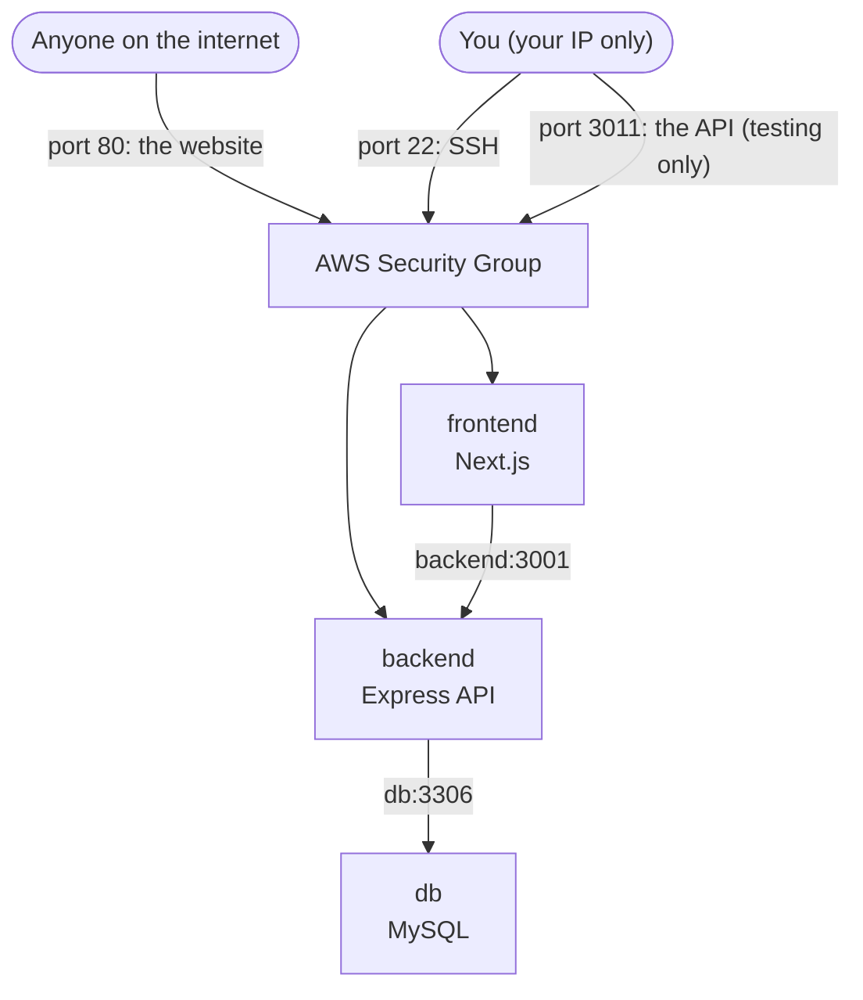

# App Description
Web application named Singitronic is a full stack e-commerce web app with customer facing store and admin dashboard.
Customer can browse products by category, search, filter/sort, view product details, add items to a cart or wishlist, and check out.
Admins get a separate dashboard to manage products, categories, merchants, orders, and users.
The app is split into two parts: a Next.js frontend (the website + admin UI) and a separate Node.js/Express backend (the REST API), both talking to a shared MySQL database through Prisma.

# Optimisation Choices
- Multi-stage Docker build in both Dockerfiles (deps -> build -> runner) - build tools, source files, and dev dependencies never ship in the final image, only the finished app.
- Base image used: node:20-alpine - a much smaller Linux base than the default node:20 image.
- Next.js `output: "standalone"` - traces the app and copies only the files it actually needs at runtime instead of shipping the entire node_modules folder.
- `npm ci --omit=dev` on the backend - skips devDependencies entirely.
- node_modules trimming on the backend - removed markdown docs, changelogs, source maps, non-`.d.ts` TypeScript sources, and test/docs folders that packages ship for developers, not for runtime.
- `--chown` set directly on `COPY` instructions instead of a separate `RUN chown -R` afterwards - chowning files after they're copied forces a full copy-up on a layered filesystem, silently doubling image size.
- Prisma's generated client and query-engine binary are copied explicitly in the frontend image, since Next's standalone output tracer misses this non-JS asset.
- Both containers run as a non-root user (`nextjs` / `expressjs`) instead of root.
- BuildKit cache mount (`--mount=type=cache`) on `npm ci` - speeds up rebuilds by reusing npm's download cache; does not affect final image size.
- `.dockerignore` in both frontend and backend - excludes node_modules, .git, .env files, logs, backups, and (frontend only) the entire backend directory, keeping unrelated files out of the build.
- `docker-entrypoint.web.sh` - seeds the shared uploads volume from a read-only copy baked into the image, but only the first time the volume is empty.

# Final Image Size
Before optimization:
- Frontend image size: 1.1GB
- Backend image size: 579MB

After optimization:
- Frontend image size: 144MB (87% smaller)
- Backend image size: 129MB (78% smaller)

# Architecture Notes
- Three containers, one private Docker network (`app-net`): `frontend` (Next.js), `backend` (Express API), `db` (MySQL). They reach each other by service name over that network - e.g. the backend connects to the database at `db`, not `localhost`.
- Two different backend addresses are needed for the frontend, depending on where the code runs:
  - `INTERNAL_API_BASE_URL` (`http://backend:3001`) - used by server-side/SSR code running inside the frontend container, over the internal Docker network.
  - `NEXT_PUBLIC_API_BASE_URL` - the public address, baked into the client-side bundle at build time, used by code running in the visitor's browser (which can't see internal Docker network names).
- Health checks (`wget --spider` against each service's own port) gate startup order: `depends_on: condition: service_healthy` means the frontend won't start until the backend and database report healthy, not just "running."
- Uploaded product images are stored in a shared named volume (`uploads-data`), mounted at `/app/public` in both the frontend and backend containers, so uploads persist across restarts and are visible from both sides.
- The database's data is stored in its own named volume (`mysql-data`), so it also survives container restarts/rebuilds.
- Published ports: frontend on host port `80` -> container port `3000`; backend on host port `3011` -> container port `3001`.

# Deployment Diagram (EC2)

Everything inside the dashed box below is one EC2 instance running Docker. `frontend`, `backend`, and `db` are three containers on the same private Docker network - they find each other by name (`backend`, `db`), not by IP. Only `frontend` and `backend` are reachable from outside; `db` has no port opened to the host or the internet at all, only to the other containers.

**Which ports are open where:**

| Port | Purpose | Allowed source | Reachable from |
|---|---|---|---|
| 22 | SSH into the EC2 instance | your IP only | you, only |
| 80 | frontend (the website) | everyone (`0.0.0.0/0`) | anyone on the internet |
| 3011 | backend (direct API access, for testing) | your IP only | you, only |
| 3306 (MySQL, inside `db`) | database | *no Security Group rule at all* | nothing outside Docker - not even you; only `backend` reaches it, over `app-net` |

All three containers can always reach each other over `app-net` by service name (`frontend`, `backend`, `db`), regardless of what's opened externally - the Security Group only controls what's reachable **from outside EC2**, not container-to-container traffic.

Note: I've assumed the backend testing port is `3011` (matching `docker-compose.yml` current mapping) - let me know if you actually meant a different port.
